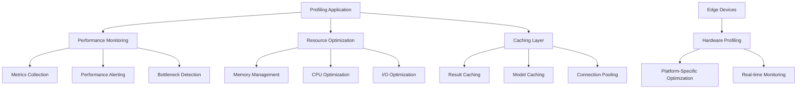

# Performance Optimization Guide

This document provides comprehensive performance optimization strategies for the tiny-llm-edge-profiler project, covering both the profiling application and target embedded devices.

## Performance Architecture Overview



## Application Performance Optimization

### 1. Memory Management Enhancement

#### Memory Pool Implementation
```python
# src/tiny_llm_profiler/memory_pool.py
import mmap
import os
from typing import Dict, List, Optional
from contextlib import contextmanager

class MemoryPool:
    """High-performance memory pool for profiling operations."""
    
    def __init__(self, pool_size: int = 64 * 1024 * 1024):  # 64MB default
        self.pool_size = pool_size
        self.pool = mmap.mmap(-1, pool_size)
        self.allocations: Dict[int, tuple] = {}
        self.free_blocks: List[tuple] = [(0, pool_size)]
        self.allocation_lock = threading.Lock()
        
    def allocate(self, size: int, alignment: int = 8) -> Optional[memoryview]:
        """Allocate aligned memory from pool."""
        aligned_size = (size + alignment - 1) & ~(alignment - 1)
        
        with self.allocation_lock:
            for i, (offset, length) in enumerate(self.free_blocks):
                if length >= aligned_size:
                    # Allocate from this block
                    if length > aligned_size:
                        # Split the block
                        self.free_blocks[i] = (offset + aligned_size, 
                                             length - aligned_size)
                    else:
                        # Use entire block
                        del self.free_blocks[i]
                    
                    # Track allocation
                    allocation_id = id(self.pool[offset:offset + size])
                    self.allocations[allocation_id] = (offset, size)
                    
                    return memoryview(self.pool[offset:offset + size])
        
        return None  # Out of memory
        
    def deallocate(self, memory_view: memoryview) -> None:
        """Deallocate memory back to pool."""
        allocation_id = id(memory_view)
        
        with self.allocation_lock:
            if allocation_id in self.allocations:
                offset, size = self.allocations.pop(allocation_id)
                
                # Add back to free blocks (with coalescing)
                self._coalesce_free_block(offset, size)
                
    def _coalesce_free_block(self, offset: int, size: int) -> None:
        """Coalesce adjacent free blocks."""
        # Implementation for memory defragmentation
        pass

# Usage in profiler
memory_pool = MemoryPool()

@contextmanager
def managed_memory(size: int):
    """Context manager for automatic memory management."""
    memory = memory_pool.allocate(size)
    try:
        yield memory
    finally:
        if memory:
            memory_pool.deallocate(memory)
```

#### Memory Usage Optimization
```python
# src/tiny_llm_profiler/optimizations.py
import gc
import psutil
from functools import wraps
from typing import Callable, Any

def memory_optimized(func: Callable) -> Callable:
    """Decorator for memory-optimized function execution."""
    @wraps(func)
    def wrapper(*args, **kwargs):
        # Pre-execution memory snapshot
        initial_memory = psutil.Process().memory_info().rss
        
        # Force garbage collection
        gc.collect()
        
        try:
            result = func(*args, **kwargs)
            return result
        finally:
            # Post-execution cleanup
            gc.collect()
            
            # Memory usage tracking
            final_memory = psutil.Process().memory_info().rss
            memory_delta = final_memory - initial_memory
            
            if memory_delta > 10 * 1024 * 1024:  # 10MB threshold
                logger.warning(f"High memory usage in {func.__name__}: {memory_delta / 1024 / 1024:.1f}MB")
    
    return wrapper

class MemoryMonitor:
    """Real-time memory usage monitoring."""
    
    def __init__(self, threshold_mb: float = 100.0):
        self.threshold = threshold_mb * 1024 * 1024
        self.peak_usage = 0
        self.allocation_history = []
        
    def check_memory_usage(self) -> Dict[str, Any]:
        """Check current memory usage and return metrics."""
        process = psutil.Process()
        memory_info = process.memory_info()
        
        current_usage = memory_info.rss
        self.peak_usage = max(self.peak_usage, current_usage)
        
        return {
            "current_mb": current_usage / 1024 / 1024,
            "peak_mb": self.peak_usage / 1024 / 1024,
            "available_mb": psutil.virtual_memory().available / 1024 / 1024,
            "percent_used": process.memory_percent(),
            "threshold_exceeded": current_usage > self.threshold
        }
```

### 2. CPU Performance Optimization

#### Multi-threading for Concurrent Profiling
```python
# src/tiny_llm_profiler/concurrent_profiler.py
import asyncio
import concurrent.futures
from typing import List, Dict, Any
import threading
from queue import Queue, PriorityQueue

class ConcurrentProfiler:
    """High-performance concurrent profiling engine."""
    
    def __init__(self, max_workers: int = None):
        self.max_workers = max_workers or min(32, (os.cpu_count() or 1) + 4)
        self.executor = concurrent.futures.ThreadPoolExecutor(
            max_workers=self.max_workers,
            thread_name_prefix="profiler_worker"
        )
        self.device_locks = {}
        self.task_queue = PriorityQueue()
        self.result_cache = {}
        
    async def profile_multiple_devices(self, 
                                     devices: List[Device], 
                                     models: List[Model]) -> Dict[str, Any]:
        """Profile multiple devices concurrently."""
        tasks = []
        
        for device in devices:
            device_lock = self._get_device_lock(device.id)
            
            for model in models:
                task = self._create_profiling_task(device, model, device_lock)
                tasks.append(task)
        
        # Execute tasks with proper resource management
        results = await asyncio.gather(*tasks, return_exceptions=True)
        
        # Process and aggregate results
        return self._aggregate_results(results)
    
    def _get_device_lock(self, device_id: str) -> threading.Lock:
        """Get or create lock for device to prevent conflicts."""
        if device_id not in self.device_locks:
            self.device_locks[device_id] = threading.Lock()
        return self.device_locks[device_id]
    
    async def _create_profiling_task(self, device: Device, 
                                   model: Model, 
                                   device_lock: threading.Lock) -> Any:
        """Create async profiling task with proper synchronization."""
        loop = asyncio.get_event_loop()
        
        def profiling_work():
            with device_lock:  # Ensure exclusive device access
                try:
                    return self._profile_device_model(device, model)
                except Exception as e:
                    logger.error(f"Profiling failed for {device.id}: {e}")
                    return {"error": str(e), "device": device.id, "model": model.name}
        
        return await loop.run_in_executor(self.executor, profiling_work)

# CPU-intensive operations optimization
import numba
from numba import jit, vectorize

@jit(nopython=True, cache=True)
def fast_statistical_analysis(data: np.ndarray) -> tuple:
    """JIT-compiled statistical analysis for performance metrics."""
    mean = np.mean(data)
    std = np.std(data)
    percentiles = np.percentile(data, [50, 95, 99])
    return mean, std, percentiles[0], percentiles[1], percentiles[2]

@vectorize(['float64(float64, float64)'], target='parallel')
def parallel_power_calculation(voltage, current):
    """Vectorized power calculation for multiple measurements."""
    return voltage * current
```

### 3. I/O Performance Enhancement

#### Asynchronous Device Communication
```python
# src/tiny_llm_profiler/async_communication.py
import asyncio
import aioserial
from typing import Dict, List, Optional
import time

class AsyncDeviceCommunicator:
    """High-performance async device communication."""
    
    def __init__(self):
        self.connections: Dict[str, aioserial.AioSerial] = {}
        self.connection_pool_size = 10
        self.command_timeout = 5.0
        self.retry_attempts = 3
        
    async def establish_connection(self, device_port: str, 
                                 baudrate: int = 921600) -> bool:
        """Establish async connection with optimal settings."""
        try:
            serial_conn = aioserial.AioSerial(
                device_port,
                baudrate=baudrate,
                timeout=1.0,
                write_timeout=1.0,
                bytesize=8,
                parity='N',
                stopbits=1,
                rtscts=True,  # Hardware flow control
                dsrdtr=False
            )
            
            self.connections[device_port] = serial_conn
            
            # Verify connection with ping
            await self._ping_device(device_port)
            return True
            
        except Exception as e:
            logger.error(f"Failed to connect to {device_port}: {e}")
            return False
    
    async def send_command_batch(self, device_port: str, 
                               commands: List[str]) -> List[str]:
        """Send multiple commands efficiently."""
        if device_port not in self.connections:
            raise ConnectionError(f"No connection to {device_port}")
        
        conn = self.connections[device_port]
        responses = []
        
        # Pipeline commands for better performance
        write_tasks = []
        for cmd in commands:
            task = asyncio.create_task(conn.write_async(f"{cmd}\n".encode()))
            write_tasks.append(task)
        
        # Wait for all writes to complete
        await asyncio.gather(*write_tasks)
        
        # Read responses
        for _ in commands:
            try:
                response = await asyncio.wait_for(
                    conn.readline_async(),
                    timeout=self.command_timeout
                )
                responses.append(response.decode().strip())
            except asyncio.TimeoutError:
                responses.append("TIMEOUT")
        
        return responses

# Connection pooling for multiple devices
class DeviceConnectionPool:
    """Connection pool manager for multiple devices."""
    
    def __init__(self, max_connections: int = 20):
        self.max_connections = max_connections
        self.active_connections = {}
        self.connection_semaphore = asyncio.Semaphore(max_connections)
        
    async def get_connection(self, device_port: str) -> AsyncDeviceCommunicator:
        """Get connection from pool or create new one."""
        async with self.connection_semaphore:
            if device_port not in self.active_connections:
                comm = AsyncDeviceCommunicator()
                await comm.establish_connection(device_port)
                self.active_connections[device_port] = comm
            
            return self.active_connections[device_port]
```

## Edge Device Performance Optimization

### 1. Platform-Specific Optimizations

#### ESP32 Optimization Profile
```python
# src/tiny_llm_profiler/platforms/esp32_optimizer.py
class ESP32Optimizer:
    """Performance optimization for ESP32 platform."""
    
    def __init__(self):
        self.psram_enabled = True
        self.dual_core_enabled = True
        self.frequency_scaling = True
        
    def optimize_for_model(self, model: QuantizedModel) -> Dict[str, Any]:
        """Apply ESP32-specific optimizations."""
        optimizations = {
            "cpu_frequency": self._optimize_cpu_frequency(model),
            "memory_layout": self._optimize_memory_layout(model),
            "cache_settings": self._optimize_cache_settings(model),
            "power_management": self._optimize_power_settings(model)
        }
        
        return optimizations
    
    def _optimize_cpu_frequency(self, model: QuantizedModel) -> int:
        """Determine optimal CPU frequency for model."""
        model_complexity = model.parameter_count * model.quantization_bits
        
        if model_complexity < 1_000_000:  # Small model
            return 80_000_000  # 80MHz for power efficiency
        elif model_complexity < 10_000_000:  # Medium model
            return 160_000_000  # 160MHz balanced
        else:  # Large model
            return 240_000_000  # 240MHz maximum performance
    
    def _optimize_memory_layout(self, model: QuantizedModel) -> Dict[str, str]:
        """Optimize memory allocation strategy."""
        if self.psram_enabled and model.size_bytes > 4 * 1024 * 1024:
            return {
                "model_storage": "psram",
                "activations": "internal_ram",
                "buffers": "psram"
            }
        else:
            return {
                "model_storage": "internal_ram",
                "activations": "internal_ram", 
                "buffers": "internal_ram"
            }

# ARM Cortex-M optimization
class ARMCortexMOptimizer:
    """Optimization for ARM Cortex-M platforms."""
    
    def __init__(self, core_type: str):
        self.core_type = core_type  # M0+, M4, M7, etc.
        self.has_fpu = core_type in ['M4', 'M7', 'M33']
        self.has_dsp = core_type in ['M4', 'M7']
        
    def optimize_inference(self, model: QuantizedModel) -> Dict[str, Any]:
        """Apply ARM-specific optimizations."""
        optimizations = {
            "use_neon": self.has_dsp and model.supports_simd(),
            "use_fpu": self.has_fpu and model.has_floating_point_ops(),
            "loop_unrolling": self._calculate_optimal_unrolling(),
            "memory_alignment": 32 if self.core_type == 'M7' else 16
        }
        
        if self.has_dsp:
            optimizations["dsp_instructions"] = self._generate_dsp_optimizations(model)
            
        return optimizations
```

### 2. Real-time Performance Monitoring

#### Hardware Performance Tracker
```python
# src/tiny_llm_profiler/hardware_monitor.py
import time
import threading
from dataclasses import dataclass
from typing import Dict, List
import collections

@dataclass
class PerformanceSnapshot:
    timestamp: float
    cpu_usage: float
    memory_usage: int
    temperature: float
    power_consumption: float
    inference_latency: float

class RealTimePerformanceMonitor:
    """Real-time performance monitoring for edge devices."""
    
    def __init__(self, sampling_rate_hz: float = 10.0):
        self.sampling_rate = sampling_rate_hz
        self.monitoring_active = False
        self.performance_history = collections.deque(maxlen=1000)
        self.alert_thresholds = {
            "temperature_celsius": 85.0,
            "memory_usage_percent": 95.0,
            "cpu_usage_percent": 90.0,
            "power_consumption_mw": 1000.0
        }
        
    async def start_monitoring(self, device: Device) -> None:
        """Start real-time performance monitoring."""
        self.monitoring_active = True
        
        while self.monitoring_active:
            snapshot = await self._capture_performance_snapshot(device)
            self.performance_history.append(snapshot)
            
            # Check for performance anomalies
            await self._check_performance_alerts(snapshot)
            
            # Adaptive sampling rate based on load
            sleep_time = self._calculate_adaptive_sleep_time(snapshot)
            await asyncio.sleep(1.0 / sleep_time)
    
    async def _capture_performance_snapshot(self, device: Device) -> PerformanceSnapshot:
        """Capture comprehensive performance snapshot."""
        start_time = time.time()
        
        # Concurrent data collection for minimal overhead
        tasks = [
            device.get_cpu_usage(),
            device.get_memory_usage(),
            device.get_temperature(),
            device.get_power_consumption(),
            device.measure_inference_latency()
        ]
        
        results = await asyncio.gather(*tasks)
        
        return PerformanceSnapshot(
            timestamp=start_time,
            cpu_usage=results[0],
            memory_usage=results[1],
            temperature=results[2],
            power_consumption=results[3],
            inference_latency=results[4]
        )
    
    def _calculate_adaptive_sleep_time(self, snapshot: PerformanceSnapshot) -> float:
        """Adapt sampling rate based on system load."""
        base_rate = self.sampling_rate
        
        # Increase sampling during high load
        if snapshot.cpu_usage > 80 or snapshot.temperature > 75:
            return base_rate * 2.0
        elif snapshot.cpu_usage < 20 and snapshot.temperature < 50:
            return base_rate * 0.5
        
        return base_rate

# Performance optimization recommendations engine
class PerformanceRecommendationEngine:
    """Generate optimization recommendations based on performance data."""
    
    def __init__(self):
        self.optimization_rules = self._load_optimization_rules()
        
    def analyze_performance(self, history: List[PerformanceSnapshot]) -> Dict[str, Any]:
        """Analyze performance history and generate recommendations."""
        if len(history) < 10:
            return {"status": "insufficient_data"}
        
        analysis = {
            "bottlenecks": self._identify_bottlenecks(history),
            "optimization_opportunities": self._find_optimizations(history),
            "performance_trends": self._analyze_trends(history),
            "recommendations": self._generate_recommendations(history)
        }
        
        return analysis
    
    def _identify_bottlenecks(self, history: List[PerformanceSnapshot]) -> List[str]:
        """Identify performance bottlenecks."""
        bottlenecks = []
        
        avg_cpu = sum(s.cpu_usage for s in history) / len(history)
        avg_memory = sum(s.memory_usage for s in history) / len(history)
        avg_temp = sum(s.temperature for s in history) / len(history)
        
        if avg_cpu > 85:
            bottlenecks.append("cpu_bound")
        if avg_memory > 90:
            bottlenecks.append("memory_bound")
        if avg_temp > 80:
            bottlenecks.append("thermal_throttling")
            
        return bottlenecks
```

## Caching and Data Management

### 1. Intelligent Result Caching
```python
# src/tiny_llm_profiler/caching.py
import hashlib
import pickle
import sqlite3
from typing import Any, Optional
import time
import threading

class ProfilingResultCache:
    """High-performance caching for profiling results."""
    
    def __init__(self, cache_size_mb: int = 100):
        self.cache_size = cache_size_mb * 1024 * 1024
        self.memory_cache = {}
        self.cache_stats = {"hits": 0, "misses": 0, "evictions": 0}
        self.cache_lock = threading.RLock()
        
        # Persistent cache using SQLite
        self.db_path = "profiling_cache.db"
        self._init_persistent_cache()
        
    def _generate_cache_key(self, model: QuantizedModel, 
                          device: Device, 
                          config: Dict[str, Any]) -> str:
        """Generate unique cache key for profiling configuration."""
        key_data = {
            "model_hash": model.get_hash(),
            "device_id": device.id,
            "device_firmware": device.firmware_version,
            "config": sorted(config.items())
        }
        
        key_string = str(key_data)
        return hashlib.sha256(key_string.encode()).hexdigest()
    
    def get_cached_result(self, cache_key: str) -> Optional[Any]:
        """Retrieve cached profiling result."""
        with self.cache_lock:
            # Check memory cache first
            if cache_key in self.memory_cache:
                entry = self.memory_cache[cache_key]
                if self._is_cache_entry_valid(entry):
                    self.cache_stats["hits"] += 1
                    entry["last_accessed"] = time.time()
                    return entry["result"]
                else:
                    del self.memory_cache[cache_key]
            
            # Check persistent cache
            result = self._get_from_persistent_cache(cache_key)
            if result:
                self.cache_stats["hits"] += 1
                # Promote to memory cache
                self._store_in_memory_cache(cache_key, result)
                return result
            
            self.cache_stats["misses"] += 1
            return None
    
    def store_result(self, cache_key: str, result: Any, 
                    ttl_seconds: int = 86400) -> None:
        """Store profiling result in cache."""
        with self.cache_lock:
            # Store in memory cache
            self._store_in_memory_cache(cache_key, result, ttl_seconds)
            
            # Store in persistent cache
            self._store_in_persistent_cache(cache_key, result, ttl_seconds)
            
            # Manage cache size
            self._evict_if_needed()

# Model caching for faster loading
class ModelCache:
    """Efficient model caching system."""
    
    def __init__(self, max_models: int = 5):
        self.max_models = max_models
        self.cached_models = collections.OrderedDict()
        self.model_lock = threading.Lock()
        
    def get_model(self, model_path: str) -> Optional[QuantizedModel]:
        """Get model from cache or load if not cached."""
        with self.model_lock:
            if model_path in self.cached_models:
                # Move to end (most recently used)
                model = self.cached_models.pop(model_path)
                self.cached_models[model_path] = model
                return model
            
            # Load model and cache it
            model = QuantizedModel.from_file(model_path)
            
            if len(self.cached_models) >= self.max_models:
                # Remove least recently used
                self.cached_models.popitem(last=False)
            
            self.cached_models[model_path] = model
            return model
```

## Performance Testing and Benchmarking

### 1. Automated Performance Regression Detection
```python
# tests/performance/test_regression.py
import pytest
import time
from typing import Dict, List
import statistics

class PerformanceRegression:
    """Detect performance regressions in profiling operations."""
    
    def __init__(self, baseline_file: str = "performance_baseline.json"):
        self.baseline_file = baseline_file
        self.current_results = {}
        self.regression_threshold = 0.15  # 15% performance degradation threshold
        
    @pytest.mark.performance
    def test_profiling_latency_regression(self):
        """Test for latency regression in profiling operations."""
        test_cases = [
            {"model_size": "small", "platform": "esp32"},
            {"model_size": "medium", "platform": "esp32"},
            {"model_size": "small", "platform": "stm32f7"},
        ]
        
        for case in test_cases:
            latencies = self._measure_profiling_latency(case)
            avg_latency = statistics.mean(latencies)
            
            baseline = self._get_baseline_latency(case)
            if baseline:
                regression = (avg_latency - baseline) / baseline
                assert regression < self.regression_threshold, \
                    f"Performance regression detected: {regression:.2%} for {case}"
            
            self._update_baseline(case, avg_latency)
    
    def _measure_profiling_latency(self, test_case: Dict[str, str]) -> List[float]:
        """Measure profiling latency for test case."""
        latencies = []
        
        for _ in range(10):  # Multiple measurements for statistical significance
            start_time = time.perf_counter()
            
            # Simulate profiling operation
            self._simulate_profiling(test_case)
            
            end_time = time.perf_counter()
            latencies.append(end_time - start_time)
        
        return latencies

# Performance benchmarking suite
@pytest.mark.benchmark
class PerformanceBenchmarkSuite:
    """Comprehensive performance benchmarking."""
    
    def benchmark_concurrent_profiling(self, benchmark):
        """Benchmark concurrent profiling performance."""
        devices = self._create_mock_devices(5)
        models = self._create_test_models(3)
        
        profiler = ConcurrentProfiler()
        
        def profiling_workload():
            return asyncio.run(profiler.profile_multiple_devices(devices, models))
        
        result = benchmark(profiling_workload)
        
        # Validate performance metrics
        assert result is not None
        benchmark.extra_info["devices_profiled"] = len(devices) * len(models)
        benchmark.extra_info["throughput_ops_per_sec"] = len(devices) * len(models) / benchmark.stats.mean
```

This comprehensive performance optimization framework ensures the tiny-llm-edge-profiler operates efficiently across various hardware platforms while maintaining high throughput and low latency for profiling operations.