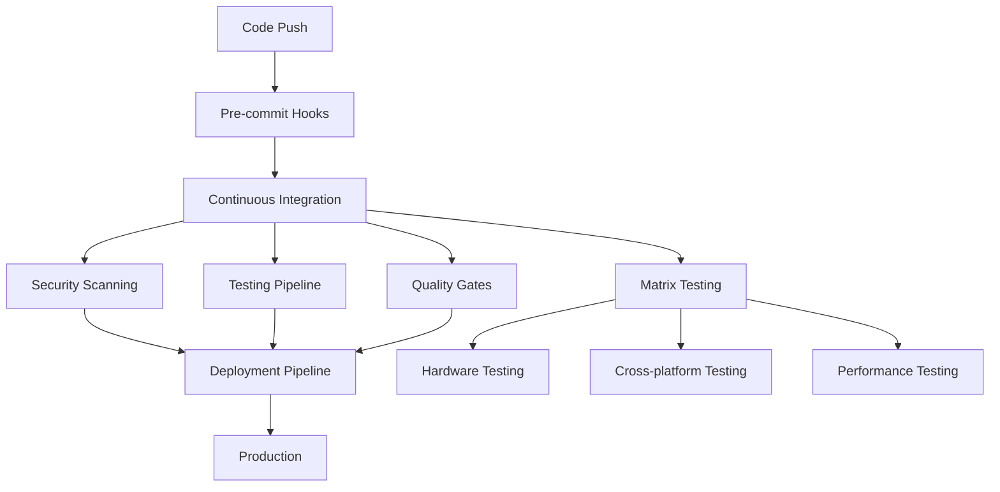

# Advanced CI/CD Workflow Configuration

This document provides comprehensive CI/CD workflow specifications for the tiny-llm-edge-profiler project, designed to be implemented as GitHub Actions workflows while maintaining flexibility for other CI/CD platforms.

## Workflow Architecture Overview



## Core CI/CD Principles

### 1. Security-First Approach
- **Supply Chain Security**: SBOM generation and vulnerability scanning
- **Code Security**: Static analysis, dependency scanning, and secret detection
- **Container Security**: Image scanning and hardening
- **Runtime Security**: Security monitoring and threat detection

### 2. Hardware-in-the-Loop Testing
- **Multi-platform Support**: ESP32, STM32, RISC-V, RP2040
- **Device Simulation**: Mock hardware for CI environments
- **Real Hardware Integration**: Selective hardware testing for releases

### 3. Progressive Quality Gates
- **Fast Feedback**: Unit tests and linting in under 2 minutes
- **Comprehensive Testing**: Integration and hardware tests for quality assurance
- **Performance Validation**: Benchmarking and regression detection

## Continuous Integration Workflows

### Primary CI Workflow Specification

#### File: `.github/workflows/ci-comprehensive.yml`

```yaml
name: Comprehensive CI Pipeline

on:
  push:
    branches: [main, develop]
  pull_request:
    branches: [main, develop]
  schedule:
    - cron: '0 6 * * *'  # Daily security scans

env:
  PYTHON_VERSION: '3.11'
  POETRY_VERSION: '1.6.1'
  CACHE_VERSION: 'v1'

jobs:
  # Fast feedback - runs in parallel
  pre-flight:
    name: Pre-flight Checks
    runs-on: ubuntu-latest
    timeout-minutes: 10
    outputs:
      python-matrix: ${{ steps.python-versions.outputs.matrix }}
      os-matrix: ${{ steps.os-versions.outputs.matrix }}
    steps:
      - name: Checkout code
        uses: actions/checkout@v4
        with:
          fetch-depth: 0

      - name: Set up Python
        uses: actions/setup-python@v4
        with:
          python-version: ${{ env.PYTHON_VERSION }}

      - name: Cache dependencies
        uses: actions/cache@v3
        with:
          path: |
            ~/.cache/pip
            ~/.cache/pre-commit
          key: ${{ runner.os }}-deps-${{ env.CACHE_VERSION }}-${{ hashFiles('requirements*.txt', '.pre-commit-config.yaml') }}

      - name: Install dependencies
        run: |
          pip install -r requirements-dev.txt
          pre-commit install

      - name: Pre-commit checks
        run: pre-commit run --all-files

      - name: Set matrix outputs
        id: python-versions
        run: echo "matrix=['3.8', '3.9', '3.10', '3.11', '3.12']" >> $GITHUB_OUTPUT

      - name: Set OS matrix
        id: os-versions  
        run: echo "matrix=['ubuntu-latest', 'windows-latest', 'macos-latest']" >> $GITHUB_OUTPUT

  # Security scanning
  security-scan:
    name: Security Analysis
    runs-on: ubuntu-latest
    needs: pre-flight
    timeout-minutes: 15
    permissions:
      security-events: write
      contents: read
    steps:
      - name: Checkout code
        uses: actions/checkout@v4

      - name: Set up Python
        uses: actions/setup-python@v4
        with:
          python-version: ${{ env.PYTHON_VERSION }}

      - name: Install security tools
        run: |
          pip install bandit safety pip-audit semgrep
          pip install -r requirements.txt

      - name: Run Bandit security scan
        run: |
          bandit -r src/ -f json -o reports/bandit-report.json
          bandit -r src/ -f txt

      - name: Run Safety dependency scan
        run: |
          safety check --json --output reports/safety-report.json
          safety check

      - name: Run pip-audit
        run: |
          pip-audit --format=json --output=reports/pip-audit.json
          pip-audit

      - name: Run Semgrep analysis
        run: |
          semgrep --config=auto --json --output=reports/semgrep.json src/
          semgrep --config=auto src/

      - name: Upload security reports
        uses: actions/upload-artifact@v3
        if: always()
        with:
          name: security-reports
          path: reports/

  # Matrix testing across Python versions and OS
  test-matrix:
    name: Test Suite (${{ matrix.python-version }}, ${{ matrix.os }})
    runs-on: ${{ matrix.os }}
    needs: pre-flight
    timeout-minutes: 30
    strategy:
      fail-fast: false
      matrix:
        python-version: ${{ fromJson(needs.pre-flight.outputs.python-matrix) }}
        os: ${{ fromJson(needs.pre-flight.outputs.os-matrix) }}
        exclude:
          # Exclude slow combinations for PR builds
          - python-version: '3.8'
            os: 'windows-latest'
          - python-version: '3.9' 
            os: 'macos-latest'

    steps:
      - name: Checkout code
        uses: actions/checkout@v4

      - name: Set up Python ${{ matrix.python-version }}
        uses: actions/setup-python@v4
        with:
          python-version: ${{ matrix.python-version }}

      - name: Cache dependencies
        uses: actions/cache@v3
        with:
          path: ~/.cache/pip
          key: ${{ runner.os }}-pip-${{ matrix.python-version }}-${{ hashFiles('requirements*.txt') }}

      - name: Install dependencies
        run: |
          pip install -r requirements-dev.txt
          pip install -e .

      - name: Run unit tests
        run: |
          pytest tests/unit/ -v --cov=src/tiny_llm_profiler --cov-report=xml --cov-report=html
          
      - name: Run integration tests
        run: |
          pytest tests/integration/ -v --timeout=300

      - name: Upload coverage reports
        uses: codecov/codecov-action@v3
        with:
          file: ./coverage.xml
          flags: unittests
          name: codecov-${{ matrix.os }}-py${{ matrix.python-version }}

  # Hardware simulation testing
  hardware-simulation:
    name: Hardware Simulation Tests
    runs-on: ubuntu-latest
    needs: pre-flight
    timeout-minutes: 45
    services:
      # Mock MQTT broker for device communication testing
      mosquitto:
        image: eclipse-mosquitto:2.0
        ports:
          - 1883:1883
        options: >-
          --health-cmd "mosquitto_pub -h localhost -t test -m test"
          --health-interval 10s
          --health-timeout 5s
          --health-retries 3

    steps:
      - name: Checkout code
        uses: actions/checkout@v4

      - name: Set up Python
        uses: actions/setup-python@v4
        with:
          python-version: ${{ env.PYTHON_VERSION }}

      - name: Install system dependencies
        run: |
          sudo apt-get update
          sudo apt-get install -y socat minicom udev

      - name: Create mock devices
        run: |
          sudo mkdir -p /dev/mock
          sudo socat -d -d pty,raw,echo=0,link=/dev/mock/esp32 pty,raw,echo=0,link=/dev/mock/esp32_sim &
          sudo socat -d -d pty,raw,echo=0,link=/dev/mock/stm32 pty,raw,echo=0,link=/dev/mock/stm32_sim &
          sleep 2
          ls -la /dev/mock/

      - name: Install dependencies
        run: |
          pip install -r requirements-dev.txt
          pip install -e .

      - name: Run hardware simulation tests
        env:
          HARDWARE_SIMULATION_MODE: 1
          MOCK_DEVICE_DIR: /dev/mock
        run: |
          pytest tests/hardware/ -v -m "not real_hardware" --timeout=600

      - name: Run performance benchmarks
        run: |
          pytest tests/performance/ -v --benchmark-only --benchmark-json=reports/benchmark.json

      - name: Upload test reports
        uses: actions/upload-artifact@v3
        if: always()
        with:
          name: hardware-simulation-reports
          path: reports/

  # Container testing
  container-test:
    name: Container Testing
    runs-on: ubuntu-latest
    needs: pre-flight
    timeout-minutes: 20
    steps:
      - name: Checkout code
        uses: actions/checkout@v4

      - name: Set up Docker Buildx
        uses: docker/setup-buildx-action@v3

      - name: Build test image
        uses: docker/build-push-action@v5
        with:
          context: .
          target: testing
          tags: tiny-llm-profiler:test
          cache-from: type=gha
          cache-to: type=gha,mode=max

      - name: Run container tests
        run: |
          docker run --rm -v $PWD/reports:/app/reports tiny-llm-profiler:test

      - name: Container security scan
        uses: aquasecurity/trivy-action@master
        with:
          image-ref: tiny-llm-profiler:test
          format: 'sarif'
          output: 'reports/trivy-container.sarif'

      - name: Upload container reports
        uses: actions/upload-artifact@v3
        if: always()
        with:
          name: container-reports
          path: reports/

  # SBOM generation and vulnerability analysis
  supply-chain-security:
    name: Supply Chain Security
    runs-on: ubuntu-latest
    needs: [pre-flight, security-scan]
    timeout-minutes: 15
    steps:
      - name: Checkout code
        uses: actions/checkout@v4

      - name: Set up Python
        uses: actions/setup-python@v4
        with:
          python-version: ${{ env.PYTHON_VERSION }}

      - name: Install SBOM tools
        run: |
          pip install cyclonedx-bom pip-audit
          pip install -r requirements.txt

      - name: Generate SBOM
        run: |
          mkdir -p sbom/
          python scripts/generate_sbom.py --format cyclonedx-json --output sbom/
          cyclonedx-py --format json --output-file sbom/sbom-cyclonedx.json .

      - name: Validate SBOM
        run: |
          python scripts/validate_sbom.py sbom/sbom-cyclonedx.json

      - name: Vulnerability scan with SBOM
        run: |
          pip-audit --format=cyclonedx-json --output=sbom/vulnerabilities.json

      - name: Upload SBOM artifacts
        uses: actions/upload-artifact@v3
        with:
          name: sbom-files
          path: sbom/

      - name: Upload SARIF results
        uses: github/codeql-action/upload-sarif@v2
        if: always()
        with:
          sarif_file: sbom/vulnerabilities.sarif

  # Quality gates
  quality-gate:
    name: Quality Gate
    runs-on: ubuntu-latest
    needs: [test-matrix, hardware-simulation, container-test, supply-chain-security]
    timeout-minutes: 10
    if: always()
    steps:
      - name: Checkout code
        uses: actions/checkout@v4

      - name: Download all artifacts
        uses: actions/download-artifact@v3

      - name: Aggregate test results
        run: |
          python scripts/aggregate_test_results.py

      - name: Check quality thresholds
        run: |
          python scripts/quality_gate_check.py \
            --coverage-threshold 80 \
            --security-issues-threshold 0 \
            --performance-regression-threshold 10

      - name: Generate quality report
        run: |
          python scripts/generate_quality_report.py --output quality-report.html

      - name: Upload quality report
        uses: actions/upload-artifact@v3
        with:
          name: quality-report
          path: quality-report.html

  # Hardware-in-the-loop testing (conditional)
  hardware-integration:
    name: Hardware Integration Tests
    runs-on: self-hosted
    needs: quality-gate
    if: github.event_name == 'push' && github.ref == 'refs/heads/main'
    timeout-minutes: 120
    steps:
      - name: Checkout code
        uses: actions/checkout@v4

      - name: Set up Python
        uses: actions/setup-python@v4
        with:
          python-version: ${{ env.PYTHON_VERSION }}

      - name: Install dependencies
        run: |
          pip install -r requirements-dev.txt
          pip install -e .

      - name: Check hardware availability
        run: |
          python scripts/check_hardware_availability.py

      - name: Run hardware tests
        env:
          HARDWARE_TEST_MODE: 1
        run: |
          pytest tests/hardware/ -v --hardware --timeout=900 \
            --junit-xml=reports/hardware-junit.xml

      - name: Upload hardware test results
        uses: actions/upload-artifact@v3
        if: always()
        with:
          name: hardware-test-results
          path: reports/

# Deployment Pipeline (separate workflow)
```

### Continuous Deployment Workflow Specification

#### File: `.github/workflows/cd-production.yml`

```yaml
name: Production Deployment

on:
  workflow_run:
    workflows: ["Comprehensive CI Pipeline"]
    types: [completed]
    branches: [main]
  release:
    types: [published]

env:
  REGISTRY: ghcr.io
  IMAGE_NAME: ${{ github.repository }}

jobs:
  deploy-staging:
    name: Deploy to Staging
    runs-on: ubuntu-latest
    if: github.event.workflow_run.conclusion == 'success'
    environment: staging
    steps:
      - name: Checkout code
        uses: actions/checkout@v4

      - name: Set up Docker Buildx
        uses: docker/setup-buildx-action@v3

      - name: Log in to Container Registry
        uses: docker/login-action@v3
        with:
          registry: ${{ env.REGISTRY }}
          username: ${{ github.actor }}
          password: ${{ secrets.GITHUB_TOKEN }}

      - name: Build and push staging image
        uses: docker/build-push-action@v5
        with:
          context: .
          target: production
          push: true
          tags: ${{ env.REGISTRY }}/${{ env.IMAGE_NAME }}:staging
          cache-from: type=gha
          cache-to: type=gha,mode=max

      - name: Deploy to staging environment
        run: |
          # Deployment logic here
          echo "Deploying to staging environment"

  staging-validation:
    name: Staging Validation
    runs-on: ubuntu-latest
    needs: deploy-staging
    timeout-minutes: 30
    steps:
      - name: Run staging smoke tests
        run: |
          # Smoke tests against staging environment
          curl -f https://staging.tiny-llm-profiler.com/health

      - name: Run staging integration tests
        run: |
          # Integration tests against staging
          pytest tests/staging/ -v

  deploy-production:
    name: Deploy to Production
    runs-on: ubuntu-latest
    needs: staging-validation
    if: github.event_name == 'release'
    environment: production
    steps:
      - name: Checkout code
        uses: actions/checkout@v4

      - name: Deploy to production
        run: |
          # Production deployment logic
          echo "Deploying to production environment"

      - name: Generate deployment report
        run: |
          python scripts/generate_deployment_report.py
```

## Platform-Specific CI/CD Adaptations

### GitLab CI Configuration
```yaml
# .gitlab-ci.yml equivalent
stages:
  - pre-flight
  - security
  - test
  - hardware-simulation
  - quality-gate
  - deploy

variables:
  PYTHON_VERSION: "3.11"
  CACHE_VERSION: "v1"

cache:
  key: "${CI_COMMIT_REF_SLUG}-${CACHE_VERSION}"
  paths:
    - .cache/pip/
    - .cache/pre-commit/

pre-flight:
  stage: pre-flight
  image: python:${PYTHON_VERSION}
  script:
    - pip install -r requirements-dev.txt
    - pre-commit run --all-files
  artifacts:
    reports:
      junit: reports/pre-commit.xml
```

### Jenkins Pipeline Configuration
```groovy
// Jenkinsfile
pipeline {
    agent any
    
    environment {
        PYTHON_VERSION = '3.11'
        DOCKER_REGISTRY = 'ghcr.io'
    }
    
    stages {
        stage('Pre-flight') {
            parallel {
                stage('Lint') {
                    steps {
                        sh 'make lint'
                    }
                }
                stage('Security Scan') {
                    steps {
                        sh 'make security-check'
                    }
                    post {
                        always {
                            publishHTML([
                                allowMissing: false,
                                alwaysLinkToLastBuild: true,
                                keepAll: true,
                                reportDir: 'reports',
                                reportFiles: 'security-report.html',
                                reportName: 'Security Report'
                            ])
                        }
                    }
                }
            }
        }
        
        stage('Test Matrix') {
            matrix {
                axes {
                    axis {
                        name 'PYTHON_VERSION'
                        values '3.8', '3.9', '3.10', '3.11', '3.12'
                    }
                }
                stages {
                    stage('Test') {
                        steps {
                            sh "python${PYTHON_VERSION} -m pytest tests/"
                        }
                    }
                }
            }
        }
    }
    
    post {
        always {
            publishTestResults testResultsPattern: 'reports/junit.xml'
            publishHTML([
                allowMissing: false,
                alwaysLinkToLastBuild: true,
                keepAll: true,
                reportDir: 'reports/coverage',
                reportFiles: 'index.html',
                reportName: 'Coverage Report'
            ])
        }
    }
}
```

## Integration with Development Workflow

### Branch Protection Rules
```yaml
# Branch protection configuration (via GitHub API)
{
  "required_status_checks": {
    "strict": true,
    "contexts": [
      "Pre-flight Checks",
      "Security Analysis", 
      "Test Suite (3.11, ubuntu-latest)",
      "Hardware Simulation Tests",
      "Quality Gate"
    ]
  },
  "enforce_admins": true,
  "required_pull_request_reviews": {
    "required_approving_review_count": 2,
    "dismiss_stale_reviews": true,
    "require_code_owner_reviews": true
  },
  "restrictions": null
}
```

### Auto-merge Configuration
```yaml
# .github/workflows/auto-merge.yml
name: Auto-merge

on:
  pull_request:
    types: [labeled]

jobs:
  auto-merge:
    if: contains(github.event.label.name, 'auto-merge')
    runs-on: ubuntu-latest
    steps:
      - name: Wait for CI
        uses: fountainhead/action-wait-for-check@v1.1.0
        with:
          token: ${{ secrets.GITHUB_TOKEN }}
          checkName: "Quality Gate"
          
      - name: Auto-merge
        uses: pascalgn/merge-action@v0.15.6
        with:
          github_token: ${{ secrets.GITHUB_TOKEN }}
          merge_method: squash
```

This comprehensive CI/CD configuration provides enterprise-grade quality assurance, security scanning, and deployment automation while maintaining flexibility for different CI/CD platforms and hardware testing requirements.